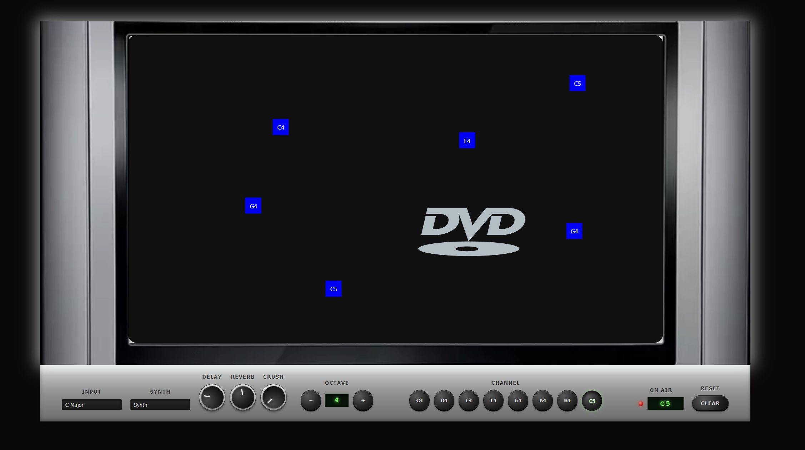
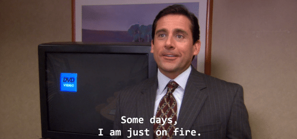

# Screensavr

A bouncing DVD logo. A 2000s TV. Notes that play when they get hit.

Inspired by old hardware, techno, and [that one scene from The Office](https://www.youtube.com/watch?v=QOtuX0jL85Y).



## Play

```bash
npm install
npm run dev
```

Click the screen to drop a note. Click a note to remove it. **Clear** wipes the board.

| Control | What it does |
| --- | --- |
| **Input** | Pick a scale (C Major, E Blues, G Major Pentatonic, …) |
| **Synth** | Four [Tone.js](https://tonejs.github.io/) voices: Synth, MonoSynth, FMSynth, AMSynth |
| **Knobs** | Delay, reverb, and bitcrush — drag up for more |
| **Octave / Channel** | Shift range and choose the next note |

Wait for the logo to bounce. That’s the instrument.


